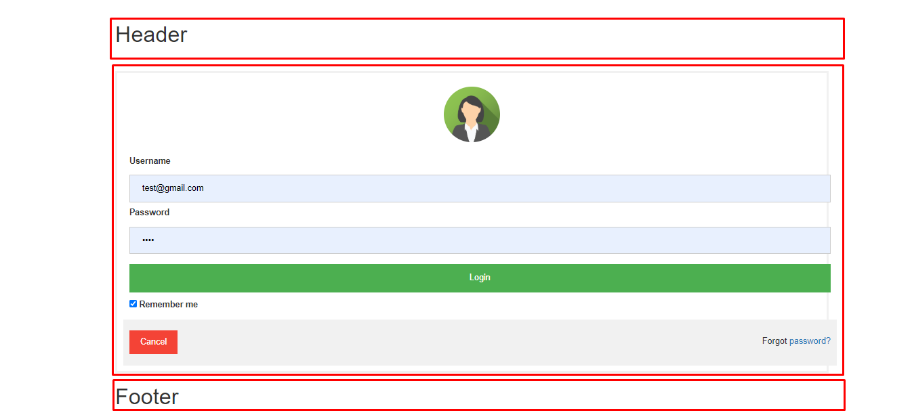

# angular-separate-header-footer-body

~~~
ng g c component/home --skipTests -is --selector=home
ng g c component/header --skipTests -is --selector=header
ng g c component/footer --skipTests -is --selector=footer
ng g c component/login --skipTests -is --selector=login
~~~
